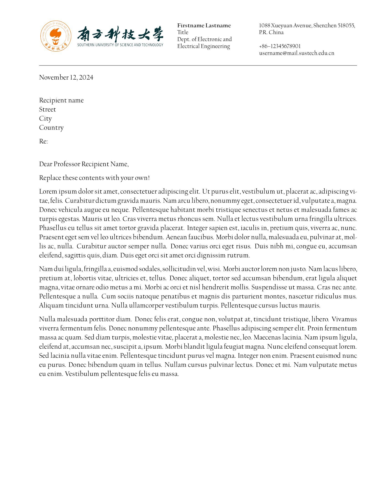
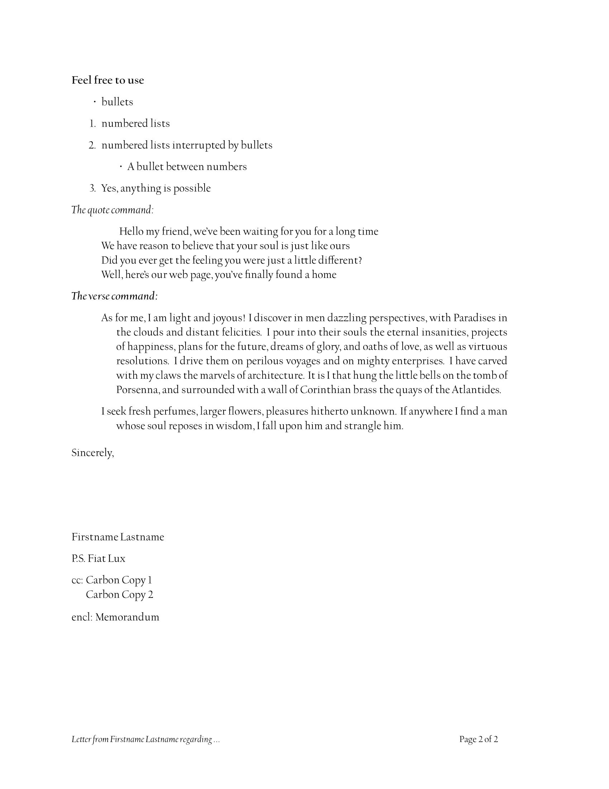

# SUSTech_Letterhead_LaTeX

南科大信头模板（正式信件）。改编自Berkeley 2020 Letterhead 4 color formal version。

## TODO

创建Typst版本

微调`SUSTech_formalheader.png`

- 其格式建议保持为1126x150，96dpi或更高；不能有黑边

## 预览

请见：[SUSTech_Letterhead.pdf](./SUSTech_Letterhead.pdf)

